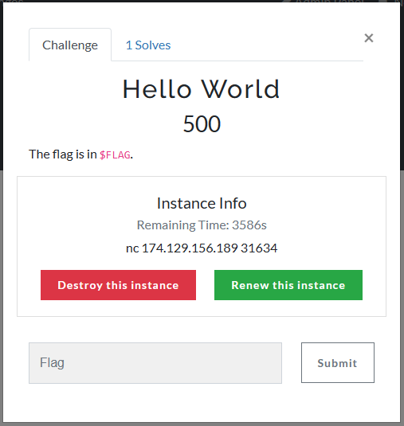

# NCU Cloud Computing and Services Final Project

A CTFd plugin to deploy per-user instances using Kubernetes. The [plugin](./CTFd/CTFd/plugins/ctfd-k8s/) is based on [frankli0324/ctfd-whale](https://github.com/frankli0324/ctfd-whale/).

It is only developed and tested on AWS EKS so far, so it needs some other modifications to work on other Kubernetes clusters.

## Deployment

> The setup is only tested on **Learner Lab** account from **AWS Academy**, which only have a `LabRole` to connect each others. To use it on regular AWS account you need to setup IAM roles manually.

### Prerequisites

* A EKS cluster
* A ECR repository
* A EC2 Server

### EC2

> Need to attach `LabRole` to the EC2 instance.

1. Install Docker and Docker Compose
2. Clone this repo to `~/deploy`
3. Setup AWS credentials:

```bash
TOKEN=`curl -s -X PUT "http://169.254.169.254/latest/api/token" -H "X-aws-ec2-metadata-token-ttl-seconds: 21600"`
curl -s -H "X-aws-ec2-metadata-token: $TOKEN" http://169.254.169.254/latest/meta-da
ta/iam/security-credentials/LabRole | jq -r '"[default]\naws_access_key_id=\(.AccessKeyId)\naws_secret_access_key=\(.Sec
retAccessKey)\naws_session_token=\(.Token)\n"' > ~/.aws/credentials
mkdir -p ~/deploy/secrets
cat ~/.aws/credentials > ~/deploy/secrets/aws_credentials
aws eks list-clusters --region us-east-1  # Testing
```

4. Add a DNS A record on a custom domain pointing to EC2 (for HTTPS) and change the domain name in `~/deploy/user_conf.d/ctfd.conf`
5. cd to `~/deploy/CTFd` and `docker compose up -d`
6. Navigate to the domain name and setup CTFd

> If you don't have a custom domain, you can modify `~/deploy/CTFd/docker-compose.yml` to use the original `nginx` instead. Then you can access your CTFd via `http://ec2-?????.compute-1.amazonaws.com`..

## Usage

### Prepare images

#### Login to ECR

```bash
eval `aws ecr get-login --region us-east-1 | sed 's/-e none//'`
```

#### Build images

Take [challenge-hello-world](./challenge-hello-world/) for example.

```bash
ECRHOST=?????.dkr.ecr.us-east-1.amazonaws.com  # Change this
docker build . -t $ECRHOST/challenge-registry:challenge-hello-world
docker push $ECRHOST/challenge-registry:challenge-hello-world
```

#### Deploy to CTFd

1. Go to admin panel
2. Create new challenge > select `dynamic_kubernetes`
3. Fill other form fields.
4. Copy the content of [challenge-template.yaml;](./challenge-hello-world/challenge-template.yaml) to **Kubernetes Config Template** field.
5. Create

> P.S. Do not fill static flag if you need to use dynamicly generated flag


